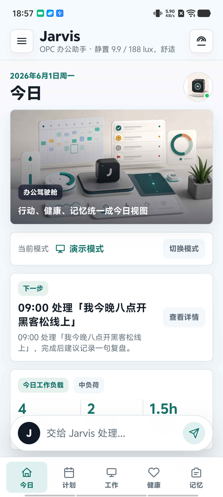

# 掌上 Jarvis

让手机成为 Agent 感知世界的窗口。

掌上 Jarvis 是一个面向 OPC 用户的轻量 Android WebView 原型。它把手机已有的摄像头、运动传感器、光线状态、文件入口和日程上下文组织起来，让 AI Agent 不再只停留在聊天框里，而是能协助用户编排工作、照看办公状态、记录生活片段，并把重要回忆沉淀成可对话的阶段性记忆。

## 项目介绍视频

[](docs/media/pocket-jarvis-agent-demo.mp4)

[观看 mp4 介绍视频](docs/media/pocket-jarvis-agent-demo.mp4)

## 核心命题

在 AI 时代，每个人都期待拥有一个像 Jarvis 一样的个人智能管家。为了让 Agent 更好地服务用户，行业正在不断寻找新的硬件形态，但掌上 Jarvis 的判断更直接：

> 手机是最贴近用户、最熟悉、也已经集成了足够多感知能力的 Agent 载体。

相比再造一件新硬件，手机天然拥有摄像头、麦克风、IMU、光线感知、电量状态、位置能力、照片、文件、日程和通知入口。掌上 Jarvis 想验证的不是“再做一个效率 App”，而是一个更大的问题：手机能否成为个人 Agent 的第一台“身体”？

## 面向 OPC 的一天

OPC 用户的一天从来不只是工作两个字。

早上需要梳理任务、会议和优先级；工作中在专注、沟通、演示和文档之间频繁切换；一旦忙起来，久坐、饮水、光照、疲劳就会被忽略。到了中午和晚上，饮食、情绪、生活片段和高光时刻又常常散落在照片、聊天记录和临时文档里。

传统工具大多只解决一个侧面：日历管时间，健康 App 管指标，日记 App 管记录，AI 聊天工具管问答。掌上 Jarvis 要做的是把同一天真正串起来：

- 想到任务，说一句就能落进计划。
- 投入工作时，手机顺手提醒当前状态。
- 随手拍、随手记的片段，被整理成可回看的生活素材。
- 重要瞬间不再只是一张照片，而能沉淀为可对话、可复盘的记忆。

## 产品闭环

掌上 Jarvis 围绕“观察 -> 计划 -> 行动 -> 记忆”构建一条低摩擦的 Agent 闭环。

| 环节 | Jarvis 做什么 | 用户获得什么 |
| --- | --- | --- |
| 观察 | 使用手机传感器和上下文生成低维状态摘要 | 不需要额外硬件，也能让 Agent 理解当前处境 |
| 计划 | 解析自然语言里的时间、任务、提醒和目标 | 一句话创建 todo、task、日程和健康提醒 |
| 行动 | 将意图路由到今日、计划、工作、健康、记忆模块 | 不必先判断该打开哪个功能 |
| 记忆 | 把日志、照片、对话和阶段性人设沉淀下来 | 让一天和人生阶段都可以被回看与复盘 |

## 四大功能

| 功能 | 解决的问题 | 当前原型能力 |
| --- | --- | --- |
| 日程编排 | 任务、会议、提醒分散，手动录入成本高 | 通过统一 Agent 输入创建 todo、task、提醒和时间线事项 |
| 办公健康提醒 | 久坐、坐姿、光照和疲劳影响办公效率 | 使用摄像头、IMU、光线等手机能力做轻量状态感知和低打扰提醒 |
| 生活日志 | 饮食、情绪和生活片段难以持续记录 | 支持随手拍、手动补充和 AI 整理，生成图文日记与日报素材 |
| 时光相册 | 高光时刻只停留在静态照片里 | 将照片转化为带人设、记忆和对话上下文的电子宠物 Agent |

## 应用模块

当前原型主界面由 5 个标签页组成，全局 Agent 输入常驻底部，负责把用户的一句话分发到正确页面和动作。

| 标签页 | 回答的问题 | 主要能力 |
| --- | --- | --- |
| 今日 | 我现在该做什么？ | 下一步行动、今日负荷、健康节奏、专注/补水/站立/日报快捷动作 |
| 计划 | 我的任务和会议怎么排？ | To-do、Calendar、Focus block、健康提醒统一时间线 |
| 工作 | 我现在如何进入办公状态？ | 专注、会议、演示、文档模式，手势识别和办公指令队列 |
| 健康 | 身体和能量还能不能撑住工作？ | 饮水、站立、久坐、光照、饮食、压力和休息建议 |
| 记忆 | 今天沉淀了什么？ | 图文日记、情绪记录、数字角色状态、日报/周报和 Agent 对话摘要 |

## 技术实现

掌上 Jarvis 采用轻量 Android WebView 架构：

- Android 原生层负责调用摄像头、手机传感器、文件选择、电量状态、网络接口和系统能力。
- Web 前端承载今日、计划、工作、健康、记忆五个产品模块。
- 全局 Agent 输入负责自然语言意图识别、时间解析、模块路由和状态写入。
- 本地状态存储贯穿日程、健康习惯、饮食照片、图文日记、传感器摘要、手势队列和 Agent 对话。

传感器原始流不会被当作长期数据保存，而是先转化为移动状态、光照状态、久坐风险和办公节奏等摘要。只有当用户主动配置并启用云端 Agent 时，系统才会发送必要文本上下文用于增强回答。

## 时光相册

掌上 Jarvis 不只把照片当作静态相册保存，而是把用户不同阶段的高光时刻转化为可交互的电子宠物 Agent。

每个高光时刻可以拥有独立 workspace，保存对应的人设、记忆、对话、目标和时间线。这样，回忆不再只是图片列表，而是可以被回看、对话和复盘的 Agent 时光相册。

## 演示路径

1. 早上开工：对 Jarvis 说“今天上午帮我安排一下”，Jarvis 解析会议、任务和提醒，生成 todo 和 task，并展示办公时间线。
2. 工作进行中：Jarvis 通过手机摄像头和 IMU 判断坐姿与静止时长，发现久坐或坐姿异常时给出低打扰提醒。
3. 午间生活记录：用户拍摄午餐，Jarvis 记录餐食、估算热量，并把生活片段归入当天日志。
4. 时光记忆封存：用户上传某个阶段的照片，Jarvis 生成数字角色，并为它创建独立 Agent workspace。

## 差异化

| 对比对象 | 传统方式 | 掌上 Jarvis |
| --- | --- | --- |
| AI 助手 | 主要停留在对话框 | 连接日程、传感器、日志和数字角色 |
| 智能硬件 | 依赖新设备和额外佩戴 | 复用每个人已经拥有的手机 |
| 日程工具 | 手动创建事项，信息孤立 | Agent 一句话创建，并统一进入时间线 |
| 健康工具 | 依赖手环、外设或主动打卡 | 使用手机传感器完成轻量监控 |
| 日记工具 | 依赖用户主动记录 | 旁观式状态摘要 + 用户补充 + AI 整理 |
| 照片相册 | 只能回看静态照片 | 生成承载阶段记忆的可交互 Agent |

## 项目结构

```text
.
├── AndroidManifest.xml
├── build.ps1
├── install.ps1
├── docs/
│   ├── media/
│   │   └── pocket-jarvis-agent-demo.mp4
│   └── Jarvis说明文档.docx
└── src/main/
    ├── assets/
    │   ├── index.html
    │   ├── app.css
    │   └── app.js
    ├── java/com/jarvis/app/
    │   ├── MainActivity.java
    │   └── JarvisFileProvider.java
    └── res/
```

## 构建

需要本地已安装 JDK、Android SDK Platform 35、Build Tools 35.0.0，并配置 `ANDROID_SDK_ROOT` 或 `ANDROID_HOME`。如果未配置，脚本默认查找 `F:\Android\sdk`。

```powershell
.\build.ps1
```

构建产物位于：

```text
build/jarvis-debug.apk
```

## 安装并启动

连接 Android 设备并确认 `adb` 可用后运行：

```powershell
.\install.ps1
```

## 未来展望

掌上 Jarvis 不是又一个效率工具，而是一次 Agent 进入现实生活的关键验证。

手机有传感器，负责感知；Agent 有大脑，负责编排；应用是手脚，负责执行；记忆系统负责长期沉淀。今天，它帮助 OPC 用户安排工作、照看状态、记录生活；明天，它会把每个人散落在手机里的日程、照片、对话和高光时刻，编织成一个真正属于自己的 AI 管家。

如果这个方向成立，Jarvis 就不只是一个 App，而是手机 Agent 时代的第一个个人工作与记忆入口。
